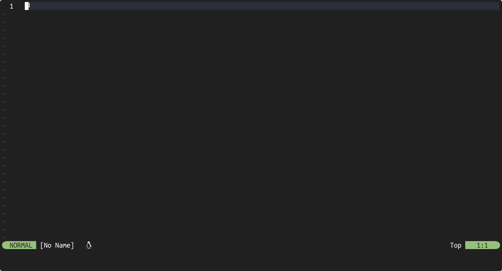

# Date Time Inserter

Date Time Inserter is a simple/basic Neovim plugin that allows you to easily
insert the current date and time into your Neovim buffer.



## Why?

This plugin does basically the same as the code block below, but this requires
the `date` command to be installed on the system. Therefore it's not always
possible to use it on every system, this is exactly what Date Time Inserter
tries to solve by using the lua built-in `os.date()` function. The plugin
allows you to insert the date and time into your Neovim buffer on every system
regardless of the operating system.

```lua
vim.keymap.set("n", "<leader>dt", ':r! date "+\\%d-\\%m-\\%Y" <CR>', {noremap = true, vim.keymap.set})
vim.keymap.set("n", "<leader>tt", ':r! date "+\\%H:\\%M:\\%S" <CR>', {noremap = true, vim.keymap.set})
```

## Installation

The example below describes how to install the plugin using
[lazy.nvim](https://github.com/folke/lazy.nvim), but you can also use other
plugin managers to install the plugin. Refer to the documentation of your
plugin manager for more information.

```lua
{
  'AntonVanAssche/date-time-inserter.nvim',
  version = '*',
  lazy = false,
  opts = {
    -- your configuration here
  }
}
```

## Configuration

You can configure the plugin by adding the following to your init.lua:

### Configuring Date Time Inserter in init.vim

While the examples below are in lua, you can adapt them for `.vim` files by
wrapping them in a lua heredoc. However, it's not recommended due to
significant slowdowns in Neovim's load time.

```vim
lua << END
    require('date-time-inserter').setup()
END
```

### Configuring Date Time Inserter in init.lua

Configure the plugin in your `init.lua` file, as demonstrated in the example
below. The default configuration is shown, and you can customize it by
modifying the values of different settings.

```lua
local date_time_inserter_status_ok, date_time_inserter = pcall(require, "date-time-inserter")
if not date_time_inserter_status_ok then
    return
end

date_time_inserter.setup {
    date_format = 'MMDDYYYY',
    date_separator = '/',
    date_time_separator = ' at ',
    time_format = 12,
    show_seconds = false,
}
```

You can customize the following settings:

- **`date_format`**: Defines the date structure using `Y`, `M`, and `D` for
  year, month, and day (e.g., `MMDDYYYY` → `12/31/2022`).
- **`time_format`**: Use `12` for 12-hour or `24` for 24-hour time (e.g., `12`
  → `1:00 PM`).
- **`date_separator`**: Character separating date parts (e.g., `-` →
  `12-31-2022`).
- **`date_time_separator`**: String separating date and time (e.g., ` at ` →
  `12-31-2022 at 11:59 AM`).
- **`show_seconds`**: Set `true` to include seconds (e.g., `true` → `11:59:41 AM`).

If you do not configure Date Time Inserter or leave certain settings
unconfigured, it will use its default settings for those settings.

## Usage

The plugin provides the following commands, which can be called in normal mode:

- `:InsertDate`: Inserts the current date into the buffer.
- `:InsertTime`: Inserts the current time into the buffer.
- `:InsertDateTime`: Inserts the current date and time into the buffer.

However, it's recommended to use the keybindings instead of the commands.

```lua
vim.keymap.set("n", "<leader>dt", ":InsertDate<CR>", {noremap = true, silent = true})
vim.keymap.set("n", "<leader>tt", ":InsertTime<CR>", {noremap = true, silent = true})
vim.keymap.set("n", "<leader>dtt", ":InsertDateTime<CR>", {noremap = true, silent = true})
```

## License

Date Time Inserter is licensed under the MIT License. See the
[LICENSE.md](./LICENSE.md) file for more information.

## Contributing

Contributions are welcome! Please feel free to submit a pull request or open an
issue for any bugs or feature requests.
